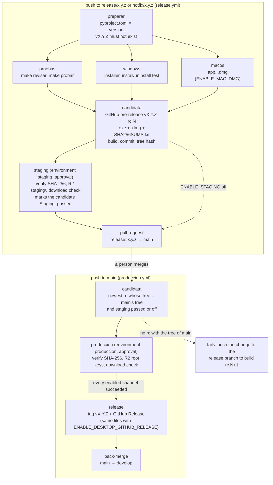

# Releasing the agent

How a version of Te Tengo Captura becomes the Windows installer and the macOS disk image that the project team (and, through the landing, households) download. The model is git flow with **release candidates** and the **tag at the end**:

- [`release.yml`](../.github/workflows/release.yml) builds both binaries **once** on the release branch and stores them as a **release candidate**: the GitHub pre-release `vX.Y.Z-rc.N`. That candidate is tried in **staging** and the pull request to `main` is opened.
- [`produccion.yml`](../.github/workflows/produccion.yml) runs when that pull request is merged. It promotes **the same files**, without rebuilding, to production. Only if every enabled channel succeeded does it create the tag `vX.Y.Z` and the GitHub Release.
- [`rollback.yml`](../.github/workflows/rollback.yml) puts an earlier release back in production.

Every Te Tengo repository follows this model (Gitflow, SemVer pre-releases, *build once, deploy many*, approvals in GitHub Environments); this page is how this repository applies it.

## Release flow

| Branch event | Workflow | What happens |
|---|---|---|
| Pull request to `develop` (`feature/*`, `bugfix/*`) | `CI` | Lint, types, tests and the Windows package. Pull requests that touch `packaging/` or `.github/scripts/` also run `release.yml`'s two builds; nothing is stored or published |
| Push to `develop` | `CI` | Checks only: this repository has no dev deployment |
| Push to `release/x.y.z` or `hotfix/x.y.z` | `CI`, `release.yml` | Candidate `vX.Y.Z-rc.N` → `staging` (approval) → pull request `release: x.y.z` to `main` |
| Push to `main` (the merged release or hotfix pull request) | `CI`, `produccion.yml` | The tested candidate → `produccion` (approval) → tag `vX.Y.Z` and GitHub Release → back-merge pull request to `develop` |
| *Run workflow* on `main` | `rollback.yml` | An earlier release `vX.Y.Z` back to the production keys (approval) |



### Push to the release branch (`release.yml`)

| Job | Environment | What it does |
|---|---|---|
| `preparar` | — | Checks that `version` in `pyproject.toml` and `__version__` in `src/te_tengo_captura/__init__.py` match ([`.github/scripts/version.sh`](../.github/scripts/version.sh)), warns when the branch name says another version, fails when the tag `vX.Y.Z` already exists (that version is released: bump it), sets the build number and writes the switch table in the run summary |
| `pruebas` | — | `make revisar` and `make probar` |
| `windows` | — | PyInstaller build, smoke test (`--version`, `--autoprueba`), optional signing, Inno Setup installer, silent install and uninstall test. Run artifact `windows` |
| `macos` | — | Only with `ENABLE_MAC_DMG`. PyInstaller `.app` on an Apple Silicon runner (`macos-15`), signature (ad-hoc, or Developer ID and notarization), bundle checks, smoke test, `.dmg`, a test of the mounted image. Run artifact `macos` |
| `candidata` | — | Creates the **pre-release `vX.Y.Z-rc.N`** on this commit (which creates the rc tag) with `te-tengo-captura-X.Y.Z-windows-setup.exe`, `te-tengo-captura-X.Y.Z-macos.dmg` (when built) and `SHA256SUMS.txt`. Its notes record the build number, the branch, the commit, the **git tree hash** (`git rev-parse HEAD^{tree}`), the run, the signing, the SHA-256 of every asset and `Staging: pending` (or `off`) |
| `staging` | `staging` | Only with `ENABLE_STAGING` and at least one R2 switch. Downloads the candidate, verifies it, uploads it to R2 under `staging/`, downloads each public URL to compare its SHA-256, and marks the candidate `Staging: passed` |
| `pull-request` | — | Opens `release: x.y.z` from the release branch to `main`, or updates its description: candidate, build, commit, tree, staging URLs, production keys and SHA-256 |

### Push to `main` (`produccion.yml`)

| Job | Environment | What it does |
|---|---|---|
| `candidata` | — | Version check, then finds **the tested candidate**: the newest published pre-release `vX.Y.Z-rc.N` whose commit tree **and** the tree recorded in its notes equal `git rev-parse HEAD^{tree}` of the `main` commit, and whose notes say `Staging: passed` or `Staging: off`. If none matches, it fails: *main differs from the tested candidate; push the change to the release branch to build a new rc*. It also fails before any approval when `ENABLE_MAC_DMG` is on and the candidate has no `.dmg`. When the tag `vX.Y.Z` already exists it stops with a notice |
| `produccion` | `produccion` | Downloads the candidate, verifies it and uploads the **same files** to the R2 root keys, each checked by downloading it. Skipped when every switch is off |
| `release` | — | Only when `produccion` succeeded (or was skipped because every switch is off): creates the GitHub Release `vX.Y.Z` on the `main` commit, which creates the tag, marked *latest*. Notes: the `CHANGELOG.md` section of the version, the candidate, build, commit, tree and SHA-256. With `ENABLE_DESKTOP_GITHUB_RELEASE` the candidate's files are attached unchanged |
| `back-merge` | — | Opens `chore: merge release x.y.z back into develop` (`main` → `develop`) |

### How identity is proven
- **One build.** The binaries are built once, on the release branch; `produccion.yml` and `rollback.yml` build nothing.
- **Durable storage.** Run artifacts expire, so the candidate lives in the pre-release `vX.Y.Z-rc.N`. Earlier candidates are never changed or deleted.
- **The SHA-256 is checked twice.** Every job that publishes runs [`.github/scripts/descargar_candidata.sh`](../.github/scripts/descargar_candidata.sh). It checks each file against the release's `SHA256SUMS.txt`, and that file against the SHA-256 block written in the notes when the candidate was created; an asset replaced later fails both. [`publicar_r2.sh`](../.github/scripts/publicar_r2.sh) then downloads each public R2 URL and compares its SHA-256 with the verified file.
- **The code is the tested code.** `main` only promotes a candidate whose git tree equals main's tree. A merge commit of the release branch has exactly the branch's files, so this holds unless `main` changed meanwhile (for example, a hotfix released while the release was in QA). Then the run fails and the change must go into the release branch as a new candidate.
- **The version inside.** The binaries carry the final version `X.Y.Z`: the installer's version and the bundle's `CFBundleShortVersionString`, which the `macos` job checks. "rc" exists only in the pre-release's name, and the asset names never contain it. The **build number** is the Release workflow's run number, recorded as `X.Y.Z+<build>` in the candidate's notes; it grows with every run.

### Releasing a version
1. Create `release/x.y.z` from `develop` (a hotfix: `hotfix/x.y.z` from `main`, with the next patch version). Bump `version` in `pyproject.toml` and `__version__` (they must match, or `preparar` fails), and move the `[Unreleased]` entries of `CHANGELOG.md` under `## [x.y.z] - <date>`: that section becomes the release notes.
2. Push. The builds run without an environment and the candidate `vX.Y.Z-rc.1` appears under *Releases* as a pre-release. Then `staging` waits for an approval on the **`staging` environment**. A required reviewer (jhosepmyr or elmer-riva) opens the run, chooses *Review deployments*, ticks the environment and approves.
3. Try the staging downloads (`<DESCARGAS_BASE_URL>/staging/te-tengo-captura-setup.exe`, `…/staging/te-tengo-captura.dmg`). **A bug found in QA** is fixed on the release branch (directly or with a `bugfix/*` pull request to it). Each push builds the next candidate (`rc.2`, `rc.3`, …) with the same version and updates the pull request; earlier candidates stay as they are.
4. The `pull-request` job opens `release: x.y.z` to `main`. Review and merge it (a merge commit; the rulesets require the review).
5. On `main`, `produccion.yml` finds the candidate and waits for an approval on **`produccion`**. After the approval it publishes, tags `vX.Y.Z`, creates the GitHub Release and opens `chore: merge release x.y.z back into develop`. Merge that one too.
6. Set `TT_AGENTE_VERSION_PUBLICADA=x.y.z` in the API, so `GET /api/agente/configuracion` announces it (see *Update notices*).

**Hotfix.** The same pipeline from `hotfix/x.y.z` (branched from `main`): candidate, a quick staging, pull request to `main`, production, tag, back-merge. In an emergency, `ENABLE_STAGING=false` skips staging (the candidate is marked `Staging: off`); production still needs its approval.

**Re-running.** A new push to the same release branch runs the pipeline again (one queue per branch) and builds a new candidate. A run that is building or deploying is never cancelled; a newer run replaces one that is still waiting for an approval. If a job of `produccion.yml` fails, **no tag is created**. *Re-run failed jobs* promotes the same candidate again (an R2 upload simply overwrites the key with the same bytes); the release is created once everything succeeded.

**Pull requests opened by the workflows.** `pull-request` and `back-merge` use `GITHUB_TOKEN`:
- the organization (or repository) setting *Settings → Actions → General → Allow GitHub Actions to create and approve pull requests* must be on; otherwise the job fails and says so;
- GitHub does not start other workflows for events caused by `GITHUB_TOKEN`, so `CI` does not run on these pull requests. That is why `CI` also runs on every push to `release/**`, `hotfix/**` and `main`: the required checks then exist on the same head commit.

### Switches
Each channel has an on/off switch: an **organization** Actions variable of `Te-Tengo-Tech` (*Settings → Secrets and variables → Actions → Variables*), the single control panel for every repository.
- **On and off.** Only the value `true` turns a channel on; an unset variable means off.
- **When a channel is off.** It is skipped and the run summary says why.
- **Always built.** The Windows installer is always built, tested and stored in the candidate.

| Variable | What it controls |
|---|---|
| `ENABLE_STAGING` | The `staging` job. Off: the candidate is marked `Staging: off` and the pull request is opened right after it |
| `ENABLE_WINDOWS_INSTALLER` | `te-tengo-captura-setup.exe` to R2 (`staging/` and the root) |
| `ENABLE_MAC_DMG` | The `macos` build (and the `.dmg` in the candidate) and `te-tengo-captura.dmg` to R2 |
| `ENABLE_MAC_NOTARIZE` | Developer ID signing and notarization of the `.app` and the `.dmg` (needs the Apple secrets below) |
| `ENABLE_DESKTOP_GITHUB_RELEASE` | The candidate's binaries attached to the final GitHub Release `vX.Y.Z`. Off: the tag and the release are still created, without binaries |

With every switch of `produccion.yml` off (`ENABLE_WINDOWS_INSTALLER`, `ENABLE_MAC_DMG`, `ENABLE_DESKTOP_GITHUB_RELEASE`), its `produccion` job is skipped, so no approval is asked, and the tag and the release are created without binaries.

### Secrets and variables
| Name | Kind | Needed for |
|---|---|---|
| `CLOUDFLARE_API_TOKEN` | Secret | R2 uploads. A Cloudflare API token with *Account → Workers R2 Storage: Edit* (the shared token of the Te Tengo repositories also has *Cloudflare Pages: Edit*). Without it, `staging`, `produccion` and `rollback` fail with a clear error |
| `CLOUDFLARE_ACCOUNT_ID` | Secret | R2 uploads (the Cloudflare account ID) |
| `DESCARGAS_BASE_URL` | Variable | The public URL of the bucket, used by the download check (`https://pub-c2d32ffba732437f83ff41fe77c0b9f1.r2.dev`) |
| `DESCARGAS_R2_BUCKET` | Variable (optional) | The bucket; default `te-tengo-descargas` |
| `MAC_DEVELOPER_ID_P12_BASE64`, `MAC_DEVELOPER_ID_P12_PASSWORD`, `APPLE_ID`, `APPLE_TEAM_ID`, `APPLE_APP_SPECIFIC_PASSWORD` | Secrets | Only with `ENABLE_MAC_NOTARIZE` (see *macOS signing and notarization*) |
| Windows signing | Secrets and variables | Optional (see *Windows code signing*) |

The GitHub Releases (candidates and final) use the workflow's `GITHUB_TOKEN`; no other token is needed.

### Where the files are
| What | Where | Written by |
|---|---|---|
| Candidate (durable, never changed) | GitHub pre-release `vX.Y.Z-rc.N`: `te-tengo-captura-X.Y.Z-windows-setup.exe`, `te-tengo-captura-X.Y.Z-macos.dmg`, `SHA256SUMS.txt` | `release.yml` → `candidata` |
| Staging | R2 `staging/te-tengo-captura-setup.exe`, `staging/te-tengo-captura.dmg` | `release.yml` → `staging` |
| Production (the landing's download) | R2 `te-tengo-captura-setup.exe`, `te-tengo-captura.dmg` | `produccion.yml` → `produccion`, `rollback.yml` |
| Final release | GitHub Release `vX.Y.Z`: the candidate's files (with `ENABLE_DESKTOP_GITHUB_RELEASE`) | `produccion.yml` → `release` |

- **Uploads.** Each R2 key is uploaded with `npx wrangler@4.149.0 r2 object put --remote` ([`.github/scripts/publicar_r2.sh`](../.github/scripts/publicar_r2.sh)) and gets a `.sha256` file next to it.
- **Size limit.** `wrangler r2 object put` uploads one object of at most 300 MiB; the installer and the disk image are well below it (the `.dmg` is about 140 MB).
- **Run artifacts.** The `windows` and `macos` run artifacts only carry the files to `candidata` and expire after 7 days (3 on pull requests).

## Rollback
*Actions → Rollback → Run workflow*, branch `main`, version `x.y.z` (a published release `vX.Y.Z`). After an approval on `produccion`, it downloads that release's binaries and verifies them like a candidate. When the binaries were not attached (`ENABLE_DESKTOP_GITHUB_RELEASE` off), it uses the candidate named in the release notes (`- Candidate: vX.Y.Z-rc.N`), which holds the same bytes. It then uploads them to the R2 root keys, per switch.
- **What it does not do.** It builds nothing and changes no tag or GitHub Release: *latest* stays on the newest version.
- **Installed agents.** R2 only serves new downloads, so installed agents keep their version; the team reinstalls the older installer where needed (Inno Setup accepts installing an older version over a newer one).
- **Afterwards.** Set `TT_AGENTE_VERSION_PUBLICADA` back in the API and fix forward with a `hotfix/x.y.z` branch.
- **Data.** The agent has no server database to restore. Its only local data is the SQLite outbox and the clip files (`src/te_tengo_captura/envios/cola.py`, created with `CREATE TABLE IF NOT EXISTS`). A version that changes that schema must say in its CHANGELOG entry whether an older agent can still read it. The API's database belongs to `te-tengo-general-api` and `te-tengo-infra`, which back it up before their own deployments.

## Windows installer
Inno Setup builds `te-tengo-captura-<version>-instalador.exe` ([`packaging/te-tengo-captura.iss`](../packaging/te-tengo-captura.iss)); `release.yml` stores it in the candidate as `te-tengo-captura-<version>-windows-setup.exe` (the name it keeps in the final GitHub Release), and production publishes the same file as `te-tengo-captura-setup.exe` (R2). In Spanish, it installs **per user** and needs **no administrator rights**.

| What | Where / how |
|---|---|
| Program (PyInstaller one-folder build) | `%LOCALAPPDATA%\Programs\TeTengoCaptura\` (the path in [INSTALLATION.md](INSTALLATION.md)) |
| Start menu shortcut | «Te Tengo Captura», for this user |
| Start with Windows | `HKCU\Software\Microsoft\Windows\CurrentVersion\Run`, value `TeTengoCaptura` = `"<path>\te-tengo-captura.exe"`. This is **the same value the agent writes itself** on every start (`src/te_tengo_captura/autoinicio.py`), so the agent finds it in place and there is never a second entry |
| Configuration (optional) | `/CONFIG="C:\ruta\config.toml"` copies the household's installation file to `%APPDATA%\TeTengoCaptura\config.toml`. An existing file is never overwritten |
| Icon | The brand icon that the PyInstaller spec draws (`build\te-tengo-captura\te-tengo-captura.ico`) |

- **Upgrades.** Running a newer installer stops this user's running agent, replaces the files and starts the agent again, if a configuration exists. The agent is also restarted after a silent install (`/VERYSILENT /SUPPRESSMSGBOXES`), which is what an automatic update would use.
- **Uninstall** (*Settings → Apps*, or `unins000.exe`):
  1. It stops the agent, then removes the program, the shortcut and the autostart value.
  2. It then asks «¿Eliminar también la configuración y los datos…?» The default is **No**, so a reinstall keeps the installation credential and any pending events.
  3. A silent uninstall keeps the data.
- **Build locally** on Windows with Inno Setup 6 installed:
  ```powershell
  make empaquetar   # or: uv run pyinstaller packaging/te-tengo-captura.spec --noconfirm
  & "${env:ProgramFiles(x86)}\Inno Setup 6\ISCC.exe" /DAppVersion=0.2.0 packaging\te-tengo-captura.iss
  ```


### Windows code signing (optional, inert until configured)
Without signing, the workflow adds a notice and the installer is unsigned. Configure **one** of these under *Settings → Secrets and variables → Actions*:

| Option | Secrets | Variables |
|---|---|---|
| **Azure Artifact Signing** (formerly *Trusted Signing*; about US$10 per month; the identity validation decides who can use it, so check whether an individual developer in Peru is eligible) | `AZURE_TENANT_ID`, `AZURE_CLIENT_ID`, `AZURE_CLIENT_SECRET` (an app registration with the *Artifact Signing Certificate Profile Signer* role) | `AZURE_SIGNING_ENDPOINT` (e.g. `https://eus.codesigning.azure.net/`), `AZURE_SIGNING_ACCOUNT`, `AZURE_CERTIFICATE_PROFILE` |
| **Code signing certificate** (.pfx, from a public CA) | `WINDOWS_PFX_BASE64` (`base64` of the .pfx), `WINDOWS_PFX_PASSWORD` | — |

- **What is signed:** both the agent exe and the installer, with SHA-256 and an RFC 3161 timestamp.
- **Since 2023,** CAs issue code signing keys only on hardware tokens or cloud HSMs. A .pfx export is therefore only possible with some cloud-key providers, which makes Azure Artifact Signing the practical option for CI.


## macOS disk image
`te-tengo-captura.dmg` holds `Te Tengo Captura.app` and a link to *Applications*: open it and drag the app there. It is built on an Apple Silicon runner, so the app is **arm64 only** (Macs with Apple silicon).

- **The bundle.** [`packaging/te-tengo-captura.spec`](../packaging/te-tengo-captura.spec) builds `dist/Te Tengo Captura.app` (bundle id `tech.tetengo.captura`, version from `__version__`) with the same contents as the Windows build: the MediaPipe model in `Contents/Resources/models/`, MediaPipe's native library and data files, the web UI and the brand icon (`.icns`). `release.yml` checks the model, `libmediapipe.dylib`, the version and the camera text, then runs `--version` and `--autoprueba` from the bundle and `--version` again from the mounted `.dmg`.
- **Camera permission.** `Info.plist` has `NSCameraUsageDescription` «Te Tengo Captura usa la webcam para detectar caídas.», the text macOS shows when it asks for camera access the first time (pending team review: `docs/BLOCKERS.md`). Under the hardened runtime the app also needs the `com.apple.security.device.camera` entitlement ([Apple: Camera entitlement](https://developer.apple.com/documentation/bundleresources/entitlements/com.apple.security.device.camera)), set in [`packaging/macos/entitlements.plist`](../packaging/macos/entitlements.plist).
- **Disk image.** [`packaging/macos/crear-dmg.sh`](../packaging/macos/crear-dmg.sh) uses only `hdiutil` (compressed `UDZO`, HFS+).
- **Build locally** on a Mac with Apple silicon:
  ```bash
  uv sync --group empaquetado && make modelo
  uv run pyinstaller packaging/te-tengo-captura.spec --noconfirm
  "dist/Te Tengo Captura.app/Contents/MacOS/te-tengo-captura" --autoprueba --logs .
  packaging/macos/crear-dmg.sh            # → dist/te-tengo-captura.dmg
  ```

### Without notarization (default)
With `ENABLE_MAC_NOTARIZE` off, PyInstaller signs the app **ad-hoc** and the workflow signs it ad-hoc again (`codesign --force --deep --sign -`, with the entitlements): Apple silicon only runs signed code, and an ad-hoc signature is enough for it. The app is not notarized, so Gatekeeper blocks the first open; the tester allows it once in *System Settings → Privacy & Security → Open Anyway* ([README, Testing on macOS](../README.md#testing-on-macos)). Fine for testing; not for households.

### macOS signing and notarization
With `ENABLE_MAC_NOTARIZE` = `true` (releases only, never pull requests), the `macos` job:
1. Fails at once, naming what is missing, unless all five secrets are set.
2. Imports the certificate into a temporary keychain and finds the *Developer ID Application* identity.
3. Builds with that identity: PyInstaller signs every binary and the bundle with the **hardened runtime**, a **secure timestamp** and the entitlements, as notarization requires ([Apple: Notarizing macOS software before distribution](https://developer.apple.com/documentation/security/notarizing-macos-software-before-distribution)). The `.dmg` is signed with the same identity.
4. Submits the `.dmg` with `xcrun notarytool submit --wait` and fails with Apple's log unless the status is `Accepted`; then `xcrun stapler staple` and `stapler validate` attach the ticket, and `spctl` checks the result.

Authentication is **an Apple ID with an app-specific password**, one of the two `notarytool` credentials ([Apple: Customizing the notarization workflow](https://developer.apple.com/documentation/security/customizing-the-notarization-workflow)). It was chosen over an App Store Connect API key because it needs no extra key file and only the Apple ID of the account holder; a team key can replace it later (`--key`, `--key-id`, `--issuer`).

| Secret | Value |
|---|---|
| `MAC_DEVELOPER_ID_P12_BASE64` | `base64` of the `.p12` export of the *Developer ID Application* certificate **with its private key** (Keychain Access → export) |
| `MAC_DEVELOPER_ID_P12_PASSWORD` | The password of that `.p12` |
| `APPLE_ID` | The Apple ID email of the Apple Developer Program account |
| `APPLE_TEAM_ID` | The 10-character team ID (developer.apple.com → Membership) |
| `APPLE_APP_SPECIFIC_PASSWORD` | An app-specific password of that Apple ID ([Apple: app-specific passwords](https://support.apple.com/en-us/102654)) |

A Developer ID certificate needs a paid Apple Developer Program membership (US$99 per year).

## Distribution
### GitHub Releases: the common path for the pilot
- **The pilot.** The project team installs every agent itself ([INSTALLATION.md](INSTALLATION.md)), so a published GitHub Release with the binaries and `SHA256SUMS.txt` is enough (with `ENABLE_DESKTOP_GITHUB_RELEASE`; every candidate pre-release has them too). Releases are versioned and free. Assets: `te-tengo-captura-<v>-windows-setup.exe`, `te-tengo-captura-<v>-macos.dmg` (with `ENABLE_MAC_DMG`) and `SHA256SUMS.txt`.
- **Public downloads.** The repository is public, so a published release's assets can be downloaded by anyone. For households, the landing page links to the stable copies in Cloudflare R2 (`te-tengo-captura-setup.exe`, `te-tengo-captura.dmg`, each with its `.sha256`), always the latest release approved on `produccion`.
- **Checking the download.** On Windows: `Get-FileHash .\te-tengo-captura-setup.exe` must match the `.sha256` file. On macOS: `shasum -a 256 te-tengo-captura.dmg`.

### SmartScreen without signing
On first run, an unsigned installer (and the unsigned exe) triggers **Microsoft Defender SmartScreen**:
- **The message.** «Windows protegió su PC», with only «No ejecutar» visible.
- **The workaround.** The installer runs after «Más información» → «Ejecutar de todas formas» ([INSTALLATION.md](INSTALLATION.md), section 3). This is acceptable for a pilot installed by the team; the decision is recorded in `docs/BLOCKERS.md` («Windows code signing»).
- **Signing alone is not enough.** Signing removes the «editor desconocido» label, but SmartScreen also uses download **reputation**. A newly signed file can still warn until it has been downloaded enough times; EV certificates no longer skip this.

### Microsoft Store (option)
- **Free.** Since 2025, individual developers can publish to the Microsoft Store **without a registration fee** ([Windows Developer Blog, 19 May 2025](https://blogs.windows.com/windowsdeveloper/2025/05/19/microsoft-store-expands-opportunities-for-windows-app-developers/)).
- **Win32 installers.** The Store accepts **Win32 apps distributed as an .exe or .msi installer**, which fits this Inno Setup installer.
- **Requirements for an .exe/.msi submission:**
  - the installer is hosted at a **versioned HTTPS URL** that never changes content (a published GitHub Release asset in a public repository works);
  - it installs **silently** (`/VERYSILENT /SUPPRESSMSGBOXES`, already supported);
  - it is **signed** with a certificate that chains to the Microsoft Trusted Root Program: the Store does not re-sign Win32 installers, so this route still needs the signing step above.
- **What it adds:**
  - a trusted install source, without SmartScreen warnings once listed;
  - a store page for households to find the app;
  - certification and the store policies, privacy policy included (camera and health-related data, Ley 29733).
- **Updates.** They still come from the installer: the Store does not update Win32 apps itself.
- **Not needed for the pilot.** It is worth it once households install the agent without the team.

## Update notices: `versionAgente`
- **What exists today.** `GET /api/agente/configuracion` returns `versionAgente`: the API's `TT_AGENTE_VERSION_PUBLICADA`. The agent fetches it at startup and every hour (`src/te_tengo_captura/umbrales_remotos.py`). When it differs from its own `__version__`, the agent **only logs it** («Versión del agente publicada: …»).
- **How it could notify updates** (a proposal; it changes `docs/AGENT_CONTRACT.md` in both repositories, so it needs the team's agreement):
  1. **Compare as versions,** not strings (`packaging.version.Version`), and act only when the published version is **newer**. That way a downgrade or a test build never triggers anything.
  2. **Notify:** show «Hay una versión nueva de Te Tengo Captura» in the window footer and as a tray notification. The copy must be added to the desktop prototype first (AGENTS.md: no invented copy). The project team then runs the new installer, which stops and restarts the agent and keeps the configuration and the outbox.
  3. **Optional automatic update:** extend the response with `urlDescarga` and `sha256` of the installer.
     - The agent downloads it to its data directory and checks the SHA-256 and the **Authenticode signature**, so this needs signing.
     - It then runs it with `/VERYSILENT /SUPPRESSMSGBOXES`. The installer stops the agent and starts the new one.
     - It should only do this while no event is pending in the outbox and no live view is open.
