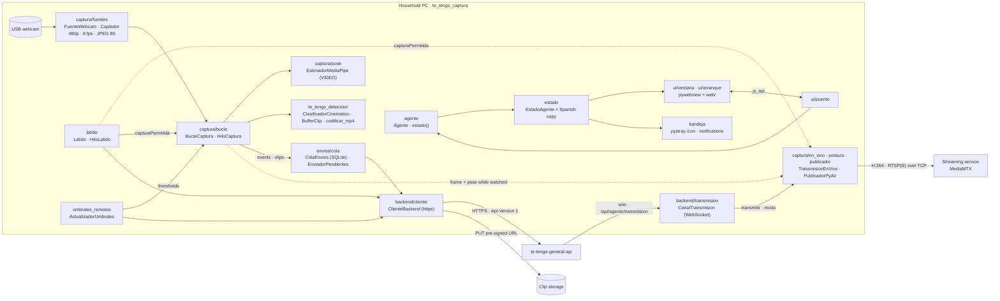

# Internal architecture

Te Tengo Captura is one Python process on the household PC. It reads the USB webcam, estimates the pose with MediaPipe on the CPU, classifies the movement with the validated kinematic classifier and sends **events and 6 s + 6 s clips** to `te-tengo-general-api` ([AGENT_CONTRACT.md](AGENT_CONTRACT.md)). Only while a family member watches the live view does it publish video, to the streaming service (MediaMTX) the API points it to. A small window and the system tray show the state. ADR 0007 explains why the processing moved from the cloud to the PC.

## Principles

1. **Two packages, one rule.** `te_tengo_deteccion` is the validated detection core: pure Python, no GUI, no network. It never imports `te_tengo_captura`, pywebview, pystray or httpx (`tests/test_dependencias.py`). `te_tengo_captura` is the desktop application around it.
2. **Same processing as the validation.** 480p, 8 fps sampled by time, JPEG quality 80, pose estimated on the decoded JPEG, MediaPipe in VIDEO mode ([validation.md](validation.md), section 2; ADR 0006).
3. **Ports and fakes.** Every outside dependency comes in through a small protocol with a fake for tests: `FuenteVideo` (`FuenteFalsa`, `FuenteArchivo`), `Estimador`, the backend (`BackendFalso` on `httpx.MockTransport`), `TransmisorEnVivo` and `Publicador` (live view), the control channel's `connect`, and the `webview` and `pystray` modules (replaced in `sys.modules`).
4. **Threads, not globals.** pywebview owns the main thread. Capture (with MediaPipe), heartbeat, outbox, remote thresholds, the state notifier, the live view publisher and its control channel each run in a worker thread. The UI receives the state through subscriptions and the JS bridge.
5. **Hard gates and no lost events.** Without consent or during a pause the webcam is closed (CA-05.2, CA-22.1). Every event goes to a persistent outbox before it is sent.

## Components



## Modules

```
src/te_tengo_deteccion/          VALIDATED CORE (logic unchanged since the validation)
├── clasificacion/               parameters (Chen et al., 2020), thresholds, state machine
├── pose/                        MediaPipe landmarker (VIDEO mode) and the Pose type
└── clips/                       6 s + 6 s BufferClip and codificar_mp4 (PyAV, ADR 0008)

src/te_tengo_captura/
├── __main__.py                  entry point: arguments, single instance, logging, autostart
├── config.py                    fixed TOML installation file (platformdirs or --config)
├── agente.py                    composition root: builds and runs the worker threads
├── estado.py                    EstadoAgente: priority and Spanish copy of the window and tray
├── latido.py                    heartbeat every 30 s; consent, pause and room name
├── umbrales_remotos.py          GET /api/agente/configuracion, hourly
├── backend/                     ClienteBackend, typed errors, BackendFalso, live view control channel
├── captura/                     sources, sampling, MediaPipe estimator, capture loop, live view
├── envios/                      persistent outbox (SQLite) and its sender thread
├── ui/                          splash, status window, JS bridge; web/ (HTML, CSS, JS, fonts)
├── bandeja/                     tray icon images, menu and notifications
├── instancia.py                 single instance (file lock + loopback socket)
├── autoinicio.py                per-user Run registry entry on Windows
├── registro.py                  rotating logs without secrets
├── autoprueba.py                --autoprueba: smoke test of a build
└── sin_interfaz.py              --sin-interfaz: the agent without window or tray (end-to-end test)
```

## Flows

**A frame** (capture thread, about 8 times per second):
1. `Captador.leer` reads the webcam and keeps one frame every 1/8 s. It downscales the frame to 480p, compresses it to JPEG 80 and decodes it again.
2. `BucleCaptura.paso` checks the gate (`Latido.captura_permitida`); without permission it closes the webcam, drops the clip buffer and resets the classifier.
3. The frame enters the clip buffer; `EstimadorMediaPipe` returns the pose; `ClasificadorCinematico.actualizar` returns the events.
4. Each event gets a UUID v7 `eventoId` and is written to the outbox; `caida` and `movimiento_inestable` also mark a clip. Six seconds later the clip is encoded off the loop thread and written to the outbox (CA-18.1). If encoding fails, the event still goes out (CA-18.2).

**An event to the backend** (outbox thread): `ColaEnvios.enviar` sends pending events in order with `POST /api/agente/eventos`; a `200` duplicate counts as delivered. Then, for each clip whose event was accepted, it requests the upload URL and `PUT`s the MP4, deleting the file afterwards. After a failure that may succeed later, the outbox waits 2 s, doubling up to 300 s with jitter.

**Capture state** (heartbeat thread): every 30 s, or as soon as the webcam state changes, `POST /api/agente/senal` reports `webcamConectada` and `deteccionConfiable`. The answer updates consent, pause and room name. The state is stored on disk, so an offline restart honours it, and a pause ends on its own at its hour (CA-22.3). Offline, the heartbeat retries at 2, 4, 8 and 16 s, then every 30 s, and the window shows the countdown.

**The window** (notifier thread → main thread): every second `Agente.estado()` derives an immutable `EstadoAgente`. Its priority is lost webcam › no internet › no consent › paused › sending. The window gets it with `ttg.actualizar(...)`, the tray updates its dot and tooltip, and `Avisos` decides the system notifications. The page patches its regions in place, so the countdown never moves the focus.

**Live view** (control channel and publisher threads, US-23): `CanalTransmision` keeps the WebSocket `/api/agente/transmision` open with the camera token. On `{"transmitir":true,…}` the capture loop starts handing each processed frame and its already estimated pose to `TransmisionEnVivo`, which only queues it (two frames; the oldest is dropped when behind). Its worker draws the picture for the mode (`postura.componer`: the frame, the frame with the skeleton, or the skeleton alone on the brand purple with no camera pixels) and `PublicadorPyAV` encodes it as H.264 and publishes it to `urlPublicacion` over RTSP/TCP. `{"transmitir":false}`, a closed channel, or capture no longer allowed (the loop calls `suspender` and the worker checks the gate) close the publisher at once. A failed publish retries at 1 s doubling up to 30 s.

**Startup**: single-instance check → logging → configuration → agent → splash (real steps: threads, webcam, first heartbeat) → status window. Closing or minimizing hides the window to the tray; «Salir» in the tray menu stops everything.

## Decisions and their records

| Topic | Where |
|---|---|
| Processing on the PC, the server retired | [ADR 0007](adr/0007-processing-on-household-pc.md) |
| MediaPipe in VIDEO mode | [ADR 0006](adr/0006-mediapipe-video-mode.md) |
| Clips with PyAV | [ADR 0008](adr/0008-clip-encoding-with-pyav.md) |
| Live view through MediaMTX | [AGENT_CONTRACT.md](AGENT_CONTRACT.md), "Live view"; `captura/en_vivo.py` and `backend/transmision.py` docstrings |
| Thresholds and their sources | [classification-spec.md](classification-spec.md), [ADR 0004](adr/0004-chen-thresholds.md) |
| Implementation choices (backoffs, intervals, timeouts) | the docstring of each module: `envios/cola.py`, `latido.py`, `captura/fuentes.py`, `captura/bucle.py`, `captura/en_vivo.py`, `captura/publicador.py`, `backend/transmision.py`, `umbrales_remotos.py`, `ui/arranque.py` |
| Open questions for the team | [BLOCKERS.md](BLOCKERS.md) |

## References

Chen, W., Jiang, Z., Guo, H., & Ni, X. (2020). Fall detection based on key points of human-skeleton using OpenPose. *Symmetry, 12*(5), 744. https://doi.org/10.3390/sym12050744

Cockburn, A. (2005). *Hexagonal architecture*. https://alistair.cockburn.us/hexagonal-architecture/

Python Packaging Authority. (s.f.). *src layout vs flat layout*. https://packaging.python.org/en/latest/discussions/src-layout-vs-flat-layout/
